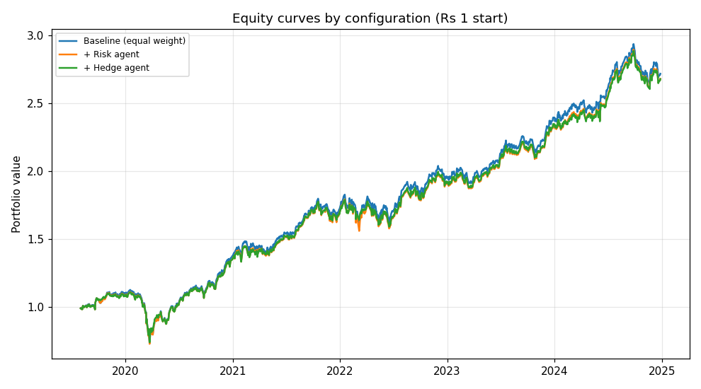

# Multi-Agent Portfolio Builder — Indian Equities (real data)

A multi-agent system that builds an **Indian large-cap stock portfolio** with a
**gold hedge**, using **real market data (yfinance)** and an **LLM-powered news
sentiment agent (Google Gemini, free tier)**.

It's the real-data successor to the synthetic-data demo: same agent architecture,
but the data and the sentiment brain are now real.

> ⚠️ Educational demo. **Not investment advice.**

---

## Agents

```
                       ┌──────────────────┐
   rebalance date  →   │   Orchestrator   │
                       └──────────────────┘
                  ┌───────────┼─────────────────┐
                  ▼           ▼                 ▼
        ┌───────────────┐ ┌──────────┐ ┌────────────────────────┐
        │ Market Data   │ │  Risk    │ │  Sentiment Agent       │
        │ (yfinance)    │ │  Agent   │ │  news API → Gemini 0–10 │
        └───────────────┘ └──────────┘ └────────────────────────┘
                  └───────────┼─────────────────┘
                              ▼
                   ┌────────────────────┐
                   │  Allocator Agent   │ → final weights (sum 100%)
                   │  + gold hedge      │
                   └────────────────────┘
```

| Agent | Now powered by |
|-------|----------------|
| **Market Data** | `yfinance` daily prices (NSE tickers, no key), cached to disk |
| **Risk** | volatility, inverse-vol weights, 0–1 market-stress signal (numpy) |
| **Sentiment** | a free **news API** → **Gemini** scores each stock **0–10** (5 = neutral) |
| **Allocator** | blends risk + sentiment, sizes the **GOLDBEES** hedge by stress |
| **Orchestrator** | runs the agents each rebalance and assembles the result |

**Universe:** 10 NSE large-caps across sectors (Reliance, TCS, Infosys, HDFC Bank,
ICICI Bank, Hindustan Unilever, ITC, L&T, Sun Pharma, Maruti) + `GOLDBEES.NS`
(gold ETF) as the hedge. Edit `config.py` to change it.

---

## Setup

```bash
pip install -r requirements.txt
cp .env.example .env        # then paste your keys into .env
```

Two free keys:
- **Gemini** — https://aistudio.google.com/apikey (the free tier, `gemini-2.5-flash-lite`, gives ~1,000 requests/day — plenty here)
- **News (Marketaux)** — https://www.marketaux.com/ (free tier, ticker-tagged, good for large-caps). For stronger India coverage you can instead use **NewsData.io** (https://newsdata.io/) by setting `NEWS_PROVIDER=newsdata` in `.env` — both are wired in.

Run it:

```bash
python run_live.py          # today's recommended portfolio (real prices + news + Gemini)
python run_backtest.py      # agent value-add study on real price history
python tests/test_offline.py   # offline sanity check, no keys needed
```

The project **degrades gracefully**: with no Gemini key it falls back to a keyword
lexicon; with no news key it treats sentiment as neutral. So you can run the
plumbing immediately and add keys after.

---

## How the Sentiment Agent works (the interesting part)

1. **Fetch** recent headlines for each stock from the news API (cached to disk).
2. **RAG re-rank** — a TF-IDF step keeps only the top-k most relevant headlines,
   so the LLM sees signal, not noise, and we send fewer tokens.
3. **Score** — all of a stock's headlines go to Gemini in **one** call that
   returns a single 0–10 score. Batching + caching keeps us inside the free quota.
4. **Fallback** — no key or an API error → a small positive/negative lexicon, so
   nothing breaks.

Why this design: the LLM call is the expensive step, so the re-rank (fewer
articles) and the score cache (never re-score the same day) are what make a
multi-stock, multi-date run affordable on a free key.

---

## Results

### Study A — agent value-add (real prices, reproducible on the free tier)

`run_backtest.py` builds the system up one agent at a time on **real yfinance
price history** and backtests each (walk-forward, monthly, no look-ahead).
Universe: 10 NSE large-caps, window **2019-01-01 → 2024-12-31**, monthly
rebalance.

| Configuration           | CAGR % | Sharpe | Max Drawdown % | ₹1 → |
|-------------------------|-------:|-------:|---------------:|-----:|
| Baseline (equal weight) |  20.31 |   1.17 |         −35.05 | 2.72 |
| + Risk agent            |  20.00 |   1.17 |         −34.41 | 2.68 |
| + Hedge agent           |  19.99 |   1.24 |         −33.21 | 2.68 |

**Read:** Risk + Hedge give up ~0.3 pp of CAGR in exchange for a better Sharpe
(1.17 → 1.24) and a ~1.8 pp smaller max drawdown — a small but real
risk-adjusted improvement on this universe and window.

#### Equity curves



Raw numbers: [outputs/ablation_results.csv](outputs/ablation_results.csv) ·
chart: [outputs/equity_curves.png](outputs/equity_curves.png).

Rerun with `python run_backtest.py` to regenerate both files.

### Study B — sentiment value-add, and the honest catch

The headline result we want is *"remove the sentiment agent and returns change."*
There's a real constraint: **free news APIs only return recent news** (days to a
few weeks) and are rate-limited, so a multi-year *sentiment* backtest isn't
possible on the free tier. Options, in order of effort:

1. **Live + recent window** — sentiment clearly drives `run_live.py` today, and
   you can backtest it over the recent window the free API covers
   (`RUN_SENTIMENT=1 python run_backtest.py`).
2. **Build a cache over time** — every fetch is cached, so running daily
   accumulates a real news history you can later backtest on.
3. **Plug in historical news** — a paid tier (or e.g. Alpha Vantage
   NEWS_SENTIMENT with `time_from`) unlocks the full multi-year sentiment
   ablation with no code changes beyond the news client.

This is called out rather than hidden because "I know exactly why the free
version can't do X, and here's the path that can" is the honest engineering story.

---

## Files

```
indian_portfolio_agents/
├── config.py                universe, keys, model, paths
├── data_sources/
│   ├── market_data.py       yfinance prices + cache
│   └── news_client.py       news API client + cache (pluggable provider)
├── llm/gemini.py            Gemini REST client (sentiment scoring)
├── agents/
│   ├── market_data_agent.py
│   ├── risk_agent.py
│   ├── sentiment_agent.py   news → RAG re-rank → Gemini 0–10 (+ lexicon fallback)
│   └── allocator_agent.py
├── orchestrator.py
├── backtest.py
├── run_live.py              today's portfolio
├── run_backtest.py          agent value-add study
├── tests/test_offline.py    runs with no keys
├── .env.example
└── requirements.txt
```

## Honest limitations (good to say out loud in an interview)

- Free news APIs give recent news only → the long sentiment backtest needs
  historical news (see Study B).
- No transaction costs / slippage modelled; monthly rebalance.
- Gemini free tier is rate-limited; caching and batching keep usage low, but a
  very large universe would need throttling or a paid tier.
- yfinance is an unofficial Yahoo wrapper and can occasionally change; prices are
  cached so a run is reproducible once fetched.
